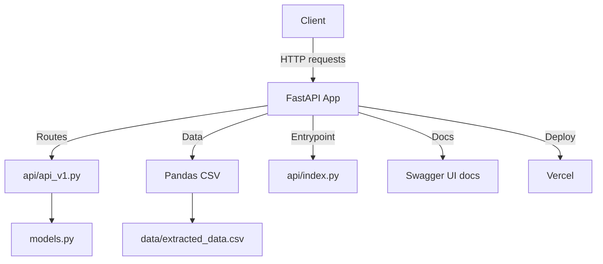

# FIAP Tech Challenge 1 – Books API

## Descrição do Projeto

Este projeto é uma API RESTful desenvolvida em Python utilizando FastAPI, destinada a consulta, busca e análise de dados de livros extraídos do site [Books to Scrape](https://books.toscrape.com/).  
A API permite listar livros, buscar por título ou categoria, consultar estatísticas e visualizar informações detalhadas sobre cada livro.

### Arquitetura

- **FastAPI**: Framework principal para construção da API.
- **Pandas**: Manipulação dos dados extraídos em CSV.
- **Estrutura de Pastas**:
  ```
  Tech Challenge 1/
  ├── api/
  │   ├── __init__.py
  │   ├── api_v1.py
  │   ├── models.py
  │   └── index.py
  ├── data/
  │   └── extracted_data.csv
  ├── requirements.txt
  ├── vercel.json
  └── README.md
  ```
- **Deploy**: Pronto para execução local ou publicação serverless via Vercel.

---

## Instruções de Instalação e Configuração

### Pré-requisitos

- Python 3.11+
- [pip](https://pip.pypa.io/en/stable/)
- [Vercel CLI](https://vercel.com/docs/cli) (opcional para deploy)

### Passos

1. **Clone o repositório**
   ```bash
   git clone https://github.com/<seu-usuario>/tech-challenge-1.git
   cd tech-challenge-1
   ```

2. **Crie e ative o ambiente virtual**
   ```bash
   python -m venv .venv
   # Windows
   .\.venv\Scripts\activate
   # Linux/Mac
   source .venv/bin/activate
   ```

3. **Instale as dependências**
   ```bash
   pip install -r requirements.txt
   ```

4. **Verifique se o arquivo de dados existe**
   - O arquivo `data/extracted_data.csv` deve estar presente.  
   - Caso queira gerar novamente, execute o crawler em `scripts/scrapy.py`.

---

## Documentação das Rotas da API

| Método | Rota                                      | Descrição                                               |
|--------|-------------------------------------------|---------------------------------------------------------|
| GET    | `/api/v1/health`                          | Verifica status da API e conectividade com os dados     |
| GET    | `/api/v1/books`                           | Lista todos os livros disponíveis                       |
| GET    | `/api/v1/books/{id}`                      | Retorna detalhes completos de um livro pelo ID          |
| GET    | `/api/v1/books/search?title=&category=`   | Busca livros por título e/ou categoria                  |
| GET    | `/api/v1/books/top-rated`                 | Lista os livros com melhor avaliação                    |
| GET    | `/api/v1/books/price-range?min=&max=`     | Filtra livros por faixa de preço                        |
| GET    | `/api/v1/categories`                      | Lista todas as categorias de livros                     |
| GET    | `/api/v1/stats/overview`                  | Estatísticas gerais da coleção                          |
| GET    | `/api/v1/stats/categories`                | Estatísticas detalhadas por categoria                   |

---

## Exemplos de Chamadas

### 1. Listar todos os livros

**Request**
```http
GET /api/v1/books
```

**Response**
```json
[
  {
    "id": 1,
    "title": "A Light in the Attic",
    "price": 51.77,
    "rating": 3,
    "availability": "In stock",
    "category": "Poetry",
    "image_url": "...",
    "book_url": "..."
  },
  ...
]
```

### 2. Buscar livro por título e categoria

**Request**
```http
GET /api/v1/books/search?title=Attic&category=Poetry
```

**Response**
```json
[
  {
    "id": 1,
    "title": "A Light in the Attic",
    "price": 51.77,
    "rating": 3,
    "availability": "In stock",
    "category": "Poetry",
    "image_url": "...",
    "book_url": "..."
  }
]
```

### 3. Estatísticas gerais

**Request**
```http
GET /api/v1/stats/overview
```

**Response**
```json
{
  "total_books": 447,
  "average_price": 35.67,
  "rating_distribution": {
    "1": 50,
    "2": 100,
    "3": 150,
    "4": 100,
    "5": 47
  }
}
```

---

## Instruções para Execução

### Local

1. Ative o ambiente virtual:
   ```bash
   .\.venv\Scripts\activate
   ```
2. Execute o servidor FastAPI:
   ```bash
   uvicorn api.api_v1:app --reload --port 8000
   ```
3. Acesse a documentação interativa:
   - [http://localhost:8000/docs](http://localhost:8000/docs)

### Deploy na Vercel

1. Instale o Vercel CLI:
   ```bash
   npm i -g vercel
   ```
2. Faça login:
   ```bash
   vercel login
   ```
3. Faça o deploy:
   ```bash
   vercel --prod
   ```
4. Acesse a URL gerada para testar a API.

---

## Diagrama de Arquitetura do Projeto



## Entrega

- [Deploy](https://tech-challenge-1-j3u9473za-mikes-projects-bc8a0889.vercel.app/api/v1/docs)